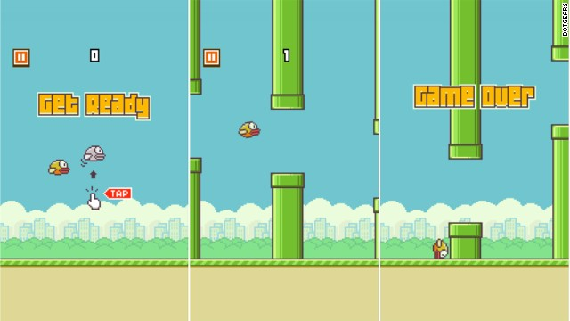

# specs floppy-bird

## Jeu "Flappy Bird"

### But

Flappy Bird est un jeu à défilement horizontal. L’objectif est de diriger un oiseau, qui se déplace continuellement vers la droite, tout en évitant des obstacles (paires de tuyaux présentant un écartement variable). Le joueur doit toucher l’écran afin de donner une impulsion verticale à l’oiseau, naturellement attiré vers le bas par gravité.

Lorsque l'oiseau heurte un tuyau ou le sol, la partie est terminée. Le score de la partie correspond au nombre d’obstacles traversés. La vitesse de défilement de l’écran (et donc, de l’oiseau) augmente avec le score.

La distance horizontale entre les obstacles (paires de tuyaux) est constante. Pour chaque obstacle, la hauteur du tuyau inférieur et son écartement avec le tuyau supérieur sont aléatoires. Chaque niveau est donc unique.

Le caractère aléatoire des niveaux est désactivable dans le menu principal. Dans ce cas, un niveau défini dans un fichier externe est chargé. Un format textuel permettant de coder un niveau sera ainsi développé.

### Exécution

Le jeu sera développé en langage C avec la SDL (version 2).

Le jeu sera exécuté sur un PC tournant sous Windows, et affiché sur un iPad utilisé en tant qu’écran externe. Ce dernier récupérera ainsi les clics du joueur.

### Menu principal

Le menu principal proposera les actions suivantes :
* Lancer une nouvelle partie en mode “normal” ;
* Lancer une nouvelle partie en mode “simplifié” ;
* Option pour activer le caractère aléatoire du niveau ;
* Lancer une démo “IA1” ;
* Lancer une démo “IA2” ;
* Quitter le jeu

#### Mode normal

Le mode normal correspond à la description du jeu telle qu’énoncée ci-dessus.

Ce mode conviendra au joueur humain.

#### Mode simplifié

Le mode simplifié présente le même gameplay que la version normale, à l’exception de la vitesse de défilement de l’écran qui n’augmente pas avec le score.

L’autre différence réside dans les graphismes : dans ce mode, des formes géométriques simples et des couleurs contrastées sont utilisées à la place des sprites.

Ce mode conviendra au robot.

### Caractère aléatoire

Cette option permet d’activer le caractère aléatoire des niveaux et affecte les modes “normal” et “simplifié”. Le caractère aléatoire affecte, pour chaque obstacle, la hauteur du tuyau inférieur et son écartement avec le tuyau supérieur.

### Démo "IA1"

Cette action lance une partie jouée par l’intelligence artificielle 1. Les clics du joueur ne sont pas pris en compte.

Cette IA est intégrée au sein même du jeu.

### Démo "IA2"

Cette action lance une série de parties jouées par l’intelligence artificielle 2. Les clics du joueur de sont pas pris en compte.

Cette IA est intégrée au sein même du jeu.

## Intelligences artificielles

### IA1

Cette intelligence artificielle décidera de donner une impulsion verticale à l’oiseau en fonction de sa position par rapport à l’obstacle suivant.

Cette IA prendra comme entrées : hauteur courante de l’oiseau, état courant de l’oiseau (élévation, chute), distance horizontale à l’obstacle suivant, hauteur du tuyau inférieur de l’obstacle suivant, écartement entre les tuyaux inférieur et supérieur de l’obstacle suivant.

L’option aléatoire est activé.

### IA2

Cette intelligence artificielle reposera sur un algorithme génétique, et n’aura donc pas connaissance des règles en début de partie.

Cette IA prendra comme entrées : état courant de la partie (échec, en cours), score de la partie, hauteur courante de l’oiseau, état courant de l’oiseau (élévation, chute), distance horizontale à l’obstacle suivant, hauteur du tuyau inférieur de l’obstacle suivant, écartement entre les tuyaux inférieur et supérieur de l’obstacle suivant.

Le mode aléatoire est désactivé lors de la phase d’apprentissage.

## Robot

L’objectif est de construire un robot capable de jouer au jeu précédemment développé, au moyen des intelligences artificielles. Le mode “simplifié” sera utilisé.

### Electronique

Le robot fonctionnera avec un Raspberry Pi.

### Interaction

Le robot interagira avec le jeu au moyen d’un stylet, actionné sur un axe par un servomoteur.

### Traitement d'image

Le robot récupérera les informations à l’aide d’une caméra. Le mode simplifié du jeu vise à simplifier cette opération : des codes couleurs permettront de déterminer les entrées nécessaires aux intelligences artificielles. Par exemple, une certaine couleur appliquée au tuyau inférieur d’un obstacle pourra informer sur sa hauteur. De même, une certaine couleur appliquée au tuyau supérieur pourra informer sur son écartement avec le tuyau inférieur. Le score de la partie sera estimé à partir du temps de jeu.

### Intelligence artificielle

Le robot implantera les deux intelligences artificielles précédemment développées. Les deux IA se détachent donc du jeu, et constituent ainsi un programme distinct. Ce dernier permettra de choisir l’intelligence artificielle à utiliser.

# Développement du projet

## Version 1

* Première version du jeu en mode “simplifié”
* Robot fabriqué et prêt à être programmé

La version 1 du projet comprendra l’implémentation du mode “simplifié” du jeu. Le niveau sera lu à partir d’un fichier externe. Lors de l’échec du niveau, ce dernier est relancé.

D’autre part, les parties mécanique et électronique du robot devront être finalisées. Nous devrons être en mesure de commander le stylet afin de simuler un clic.

## Version 2

* Contenu supplémentaire pour le jeu en mode simplifié
* Reconnaissance des formes/couleurs statiques pour le traitement d’image

La version 2 du projet comprendra l'ajout de fonctionnalités au mode simplifié du jeu : génération aléatoire des niveaux, son, intégration d'un score, sauvegarde du meilleur score, possibilité de faire pause.

D’autre part, le robot sera en mesure de reconnaître les formes et couleurs.

## Version 3

* Mode de jeu “normal”
* Menu principal
* IA1 implantée dans le jeu (démo "IA1")
* Reconnaissance des formes/couleurs dynamiques pour le traitement d'image

La version 3 du projet comprendra l’intégration du mode “normal”, avec l’introduction de sprites et l’augmentation de la vitesse de défilement en fonction du score.

L'IA1 sera implantée dans le jeu.

Le menu principal devra également être implémenté. Celui-ci permettra de lancer une partie en mode “simplifié” ou “normal”, d’activer le caractère aléatoire des niveaux générés, de lancer une démo “IA1” en mode “normal”.

D'autre part, le robot sera en mesure de reconnaître les formes et couleurs dynamiques, et de récupérer les coordonnées des objets associés.

## Version 4

* IA1 implantée dans le robot
* IA2 implantée dans le jeu (démo "IA2")

La version 4 du projet comprendra l’intégration de l’IA1 dans le robot. Les informations seront récupérées grâce au traitement d’image, à partir du mode “simplifié”.

D’autre part, l’IA2 sera implantée dans le jeu, et une démo “IA2” pourra être lancée à partir du menu principal.

## Version 5

* IA2 implantée dans le robot

La version 5 du projet comprendra l’intégration de l’IA2 dans le robot. Les informations seront récupérées grâce au traitement d’image, à partir du mode “simplifié”.
